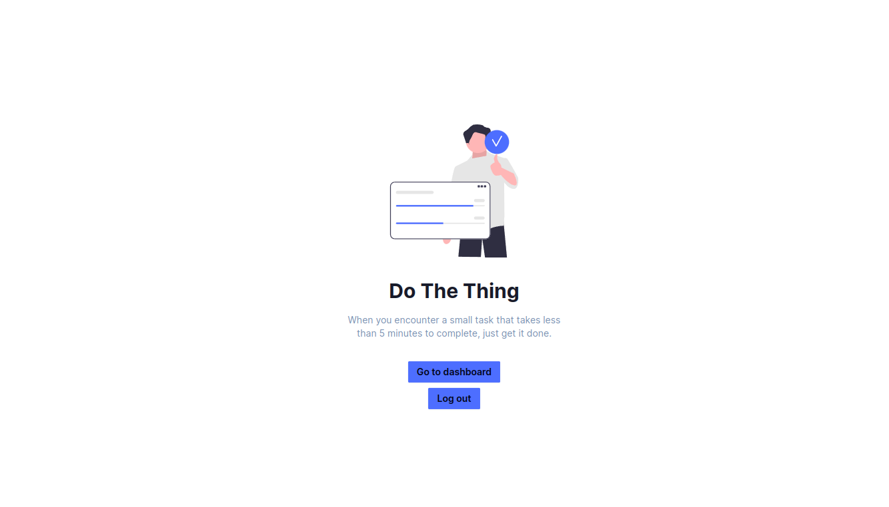
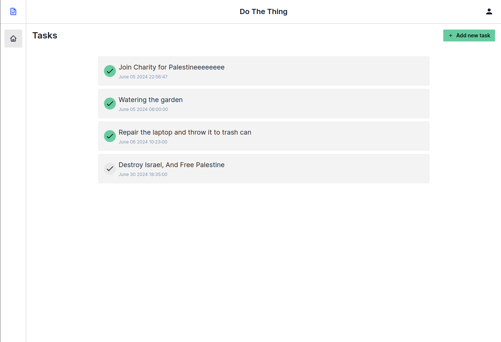

# Do The Thing

A Task Management Web App

Demo: [https://dothething.vercel.app/](https://dothething.vercel.app/)

## Screenshots

## How to run locally

1. Create a `.env.local` file in the root folder, and populate the supabase credentials
2. Run `npm i` and then `npm run dev`
3. Open `http://localhost:3000` in your browser
